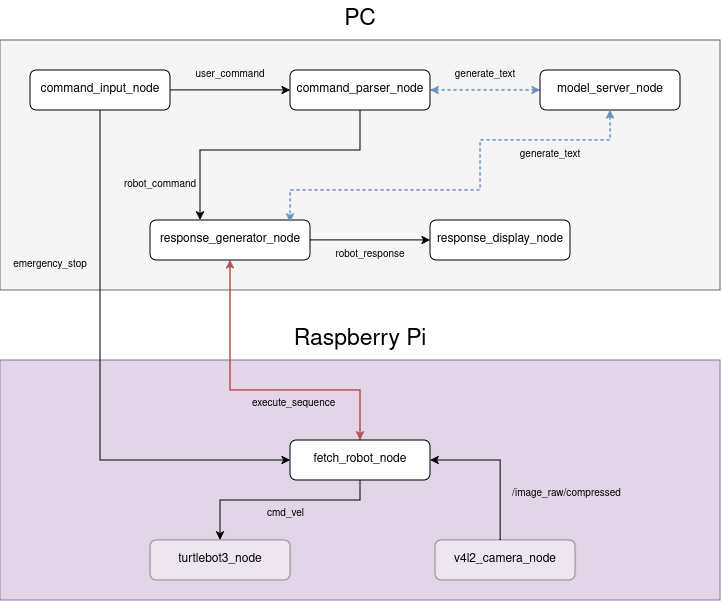

## 자연어 명령 기반 터틀봇 제어 시스템

한국어 자연어 명령으로 TurtleBot3를 제어하는 시스템 🐢

GPT 아키텍처를 구현하고 직접 학습시킨 모델이 자연어 명령을 이해하여 로봇이 실행할 수 있는 명령으로 변환하고, 실행 결과를 다시 자연어 응답으로 생성합니다.

## Environment
ROS2(Humble) 기반으로 동작합니다.
| | PC | Raspberry Pi |
|---|---|---|
| OS | Ubuntu 22.04.5 LTS | Ubuntu 22.04.5 LTS |
| ROS2 | Humble | Humble |
| Python | 3.10.12 | 3.10.12 |


**하드웨어**
- TurtleBot3 Burger
- Raspberry Pi (+ Raspberry Pi Camera)
- PC와 Raspberry Pi가 같은 네트워크(같은 `ROS_DOMAIN_ID`)로 연결되어 있는지 확인

(빌드/실행 방법은 [docs/setup.md](docs/setup.md) 참고)

## Architecture



(노드 단위 상세 구조는 [docs/architecture.md](docs/architecture.md) 참고)

## Tech Stack


- Decoder only GPT 구현·학습 (pretrained + fine-tuned)
- YOLOv8 기반 실시간 물체 탐색/추적
- PC - Raspberry Pi 분산 구조, 토픽/서비스/액션 기반 통신

## Models

| | 링크 |
|---|---|
| Pretrained | https://huggingface.co/chaex2/turtlebot-llm-fetch-pretrained |
| Fine-tuned | https://huggingface.co/chaex2/turtlebot-llm-fetch-finetuned |

- Model Architecture: Decoder only GPT, 약 124.6M 파라미터 (12 layer, 12 head, 768 dim)
- Pretraining Data: 자연어 데이터 총 ~3.59B 토큰 (train 3,478,810,175 / val 71,775,427 / test 36,505,986)
- Fine-tuning: 명령 변환·응답 생성 데이터 총 683,169건 (train 584,410건 / val 17,800건 / test 80,959건, 룰 기반 자동 생성)
- 명령 파싱과 상태 응답 생성, 두 태스크를 하나의 모델이 프롬프트만 바꿔 수행

(모델 설계 및 데이터셋 출처와 학습 과정 상세는 [docs/model.md](docs/model.md) 참고)

## Repository Structure

```
src/
├── turtlebot_llm_interfaces/   # 커스텀 msg / srv / action 정의
│   ├── msg/
│   ├── srv/
│   └── action/
│
├── turtlebot_llm_pc/           # PC 쪽 노드: 모델 서버, 명령 파싱, 응답 생성
│   ├── turtlebot_llm_pc/       # 노드 소스코드
│   ├── launch/
│   └── resource/
│
└── turtlebot_llm_robot/        # Raspberry Pi 쪽 노드: YOLO 탐색 + 모터 제어
    ├── turtlebot_llm_robot/    # 노드 소스코드
    └── resource/
```

(패키지별 상세 구성은 [PC 패키지](src/turtlebot_llm_pc/README.md), [Robot 패키지](src/turtlebot_llm_robot/README.md) 참고)

## Documentation

- [Architecture](docs/architecture.md) — 노드/토픽/서비스/액션 구조, 동시성 설계
- [Model](docs/model.md) — GPT 아키텍처, 학습 데이터, 학습 과정에서의 시행착오
- [Setup & Usage](docs/setup.md) — 빌드, 실행, 명령 예시
- [PC 패키지](src/turtlebot_llm_pc/README.md)
- [Robot 패키지](src/turtlebot_llm_robot/README.md)

## License

[MIT](LICENSE)
