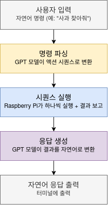

# Architecture

## Overview

  

이 프로젝트는 PC와 Raspberry Pi에 나뉘어 실행됩니다. 각 영역에서 실행되는 ROS2 노드들이
토픽/서비스/액션으로 통신하며 하나의 파이프라인을 이룹니다.

- **PC**: 사용자가 입력한 자연어 명령을 GPT 모델로 파싱하고 실행 결과를 자연어로 응답하는 역할

- **Raspberry Pi**: YOLO 기반 물체 탐색과 실제 모터 제어를 담당하고 카메라 입력을 처리

### 전체 흐름 정리

  

(상세 노드 구성은 [Nodes](#nodes), 통신 구조는 [Communication](#communication),
동시성 처리는 [Concurrency design](#concurrency-design) 참고)

## Nodes

| 노드 | 위치 | 구독 / 호출 | 발행 / 제공 |
|---|---|---|---|
| `command_input_node` | PC | — | `/user_command` (topic), `/emergency_stop` (topic) |
| `command_parser_node` | PC | `/user_command` (topic), `generate_text` (service) | `/robot_command` (topic) |
| `model_server_node` | PC | — | `generate_text` (service) |
| `response_generator_node` | PC | `/robot_command` (topic), `generate_text` (service), `execute_sequence` (action) | `/robot_response` (topic) |
| `response_display_node` | PC | `/robot_response` (topic) | — |
| `fetch_robot_node` | Raspberry Pi | `/image_raw/compressed` (topic), `/emergency_stop` (topic), `execute_sequence` (action) | `/cmd_vel` (topic) |
| `v4l2_camera_node`ⁱ | Raspberry Pi | — | `/image_raw/compressed` (topic) |
| `turtlebot3_node`ⁱ | Raspberry Pi | `/cmd_vel` (topic) | — |

ⁱ 이 리포 코드가 아닌 TurtleBot3/카메라 표준 패키지 소속

### command_input_node
터미널에서 자연어 명령을 입력받아 `/user_command`에 발행합니다. `stop`, `정지`, `비상정지` 등의
키워드는 파싱 없이 바로 `/emergency_stop`에 발행됩니다.

### command_parser_node
`/user_command`를 구독해 `"명령: {text} 답변: "` 프롬프트로 `generate_text` 서비스를
호출하고, 모델이 생성한 액션 문자열을 Action 메시지로 파싱해 `/robot_command`에 발행합니다.

### model_server_node
GPT 체크포인트를 1회 로딩하고 `generate_text` 서비스로 노출합니다.
`command_parser_node`와 `response_generator_node`가 이 서비스를 공유합니다.

### response_generator_node
`/robot_command`를 구독해 `execute_sequence` 액션 goal을 전송합니다. 액션 하나가 끝날 때마다
오는 feedback을 받아 `"상태: {...} 답변: "` 프롬프트로 `generate_text`를 호출하고, 그 결과를
`/robot_response`에 발행합니다.

### response_display_node
`/robot_response`를 구독해 터미널에 출력합니다.

### fetch_robot_node
`execute_sequence` 액션 서버입니다. `/image_raw/compressed`를 구독해 YOLO로 타겟을
탐색/추적하고, `/cmd_vel`을 발행해 로봇을 움직입니다. `/emergency_stop`을 구독해 실행 중인
시퀀스를 즉시 중단할 수 있습니다.

## Communication

토픽(pub/sub), 서비스(요청-응답), 액션(goal-feedback-result) 세 가지 통신 방식을 사용합니다.

### Topics

| 토픽 | 타입 | 발행 → 구독 |
|---|---|---|
| `/user_command` | `std_msgs/String` | `command_input_node` → `command_parser_node` |
| `/robot_command` | `turtlebot_llm_interfaces/RobotCommand` | `command_parser_node` → `response_generator_node` |
| `/robot_response` | `std_msgs/String` | `response_generator_node` → `response_display_node` |
| `/emergency_stop` | `std_msgs/Bool` | `command_input_node` → `fetch_robot_node` |
| `/image_raw/compressed` | `sensor_msgs/CompressedImage` | `v4l2_camera_node` → `fetch_robot_node` |
| `/cmd_vel` | `geometry_msgs/Twist` | `fetch_robot_node` → `turtlebot3_node` |

### Services

| 서비스 | 타입 | 서버 | 클라이언트 |
|---|---|---|---|
| `generate_text` | `turtlebot_llm_interfaces/GenerateText` | `model_server_node` | `command_parser_node`, `response_generator_node` |

### Actions

| 액션 | 타입 | 서버 | 클라이언트 |
|---|---|---|---|
| `execute_sequence` | `turtlebot_llm_interfaces/ExecuteSequence` | `fetch_robot_node` | `response_generator_node` |

`execute_sequence`는 goal로 `RobotCommand`(액션 시퀀스 전체)를 받고, 액션 하나가 끝날
때마다 feedback으로 `RobotStatus`를 보냅니다.

## Concurrency design

콜백을 3개의 그룹으로 나누어 동시 실행을 관리하였습니다.

| 콜백그룹 | 타입 | 담당 콜백 | 이유 |
|---|---|---|---|
| `action_cb_group` | `Reentrant` | `execute_callback`, `goal_callback` | `execute_callback`이 대기 중이어도 `goal_callback`이 새 goal 요청을 처리할 수 있어야 함 |
| `sensor_cb_group` | `MutuallyExclusive` | `image_callback` | 공유 변수를 프레임마다 순서대로 갱신해 race condition 방지 |
| `emergency_cb_group` | `Reentrant` | `emergency_stop_callback` | 다른 무엇이 실행 중이든 즉시 처리되어야 함 |

`MultiThreadedExecutor`를 사용해 콜백그룹들이 실제로 병렬 스레드에서 동시에 실행될 수 있게 하였습니다.

`MutuallyExclusive`: 같은 그룹 안 콜백들은 한 번에 하나씩만 실행됨
 `Reentrant`: 같은 그룹 안 콜백들은 동시에 여러 개 실행될 수 있음