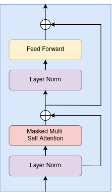
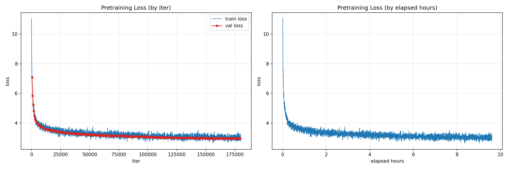
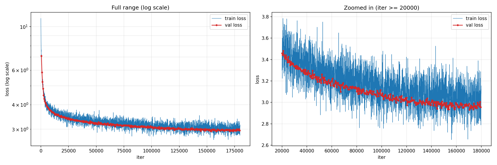
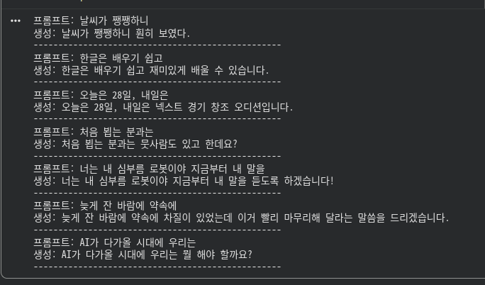
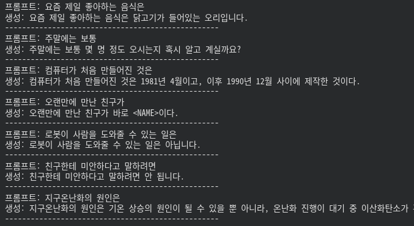
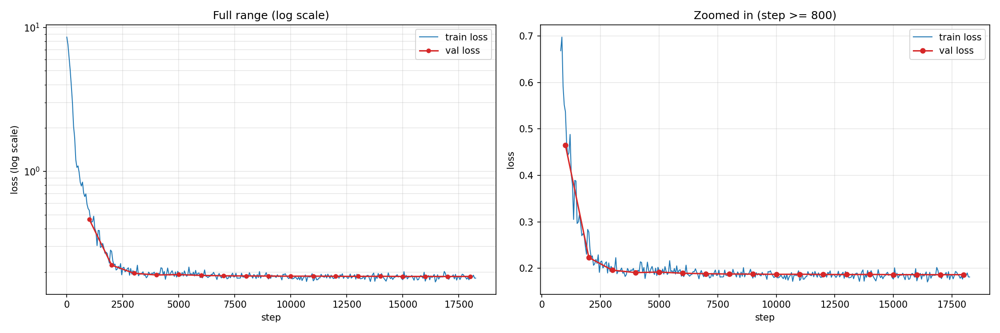
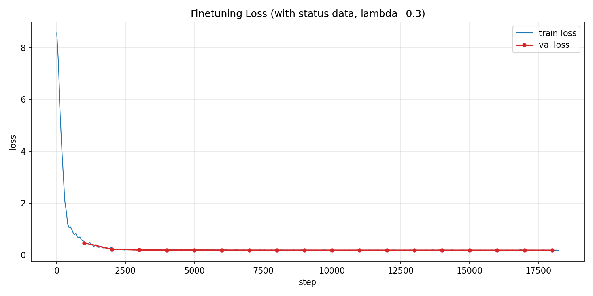
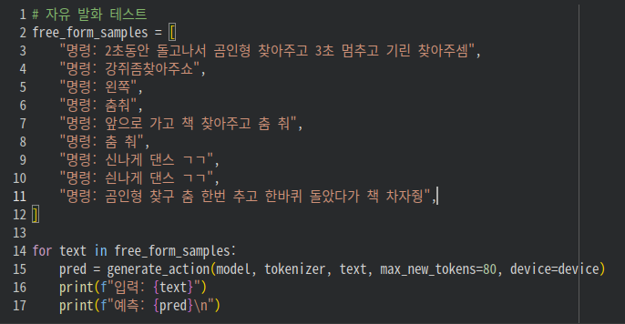
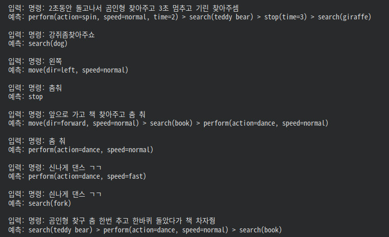
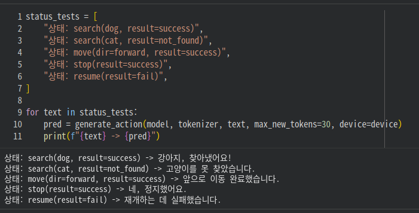

# Model

## Architecture
<div align="center">
  
</div>

이 모델은 GPT-2 스타일의 모델 아키텍처와 GPT-1 논문에서 제안된 파인튜닝 방식(auxiliary
언어모델 loss)을 함께 참고하여 설계되었습니다.

GPT 아키텍처 구현(`CausalSelfAttention`, `MLP`, `Block`, `GPT` 등 일부 클래스)은 [nanoGPT](https://github.com/karpathy/nanoGPT)(Andrej Karpathy, MIT License)를 기반으로 합니다. 토크나이저 확장, 학습 파이프라인, 생성 로직 등 나머지 구현은 프로젝트에 맞게 직접 구현했습니다.

- Decoder-only GPT, 12 layer / 12 head / 768 dim, 약 124.6M(1.246억 개) 파라미터
- block_size: 256
- Tokenizer: `skt/kogpt2-base-v2` 사용 + 로봇 명령/상태 관련 커스텀 토큰 추가 (vocab_size: 51,304)

> <sub>nanoGPT 원본 저작권 고지: Copyright (c) 2022 Andrej Karpathy — MIT License ([전문 보기](https://github.com/karpathy/nanoGPT/blob/master/LICENSE))

## Pretraining

### Training Environment

- Google Colab (A100 GPU)

### Data

| # | 데이터셋 | 출처 |
|---|---|---|
| 1 | 네이버 뉴스 요약 | [HuggingFace](https://huggingface.co/datasets/daekeun-ml/naver-news-summarization-ko/viewer/default/train?row=81) |
| 2 | 위키 문헌 | [HuggingFace](https://huggingface.co/datasets/wikimedia/wikisource/viewer/20231201.ko/train?p=2&row=290) |
| 3 | 도서자료 요약 | [AI Hub](https://www.aihub.or.kr/aihubdata/data/view.do?currMenu=115&topMenu=100&srchDataRealmCode=REALM002&aihubDataSe=data&dataSetSn=93) |
| 4 | 일반 상식 | [AI Hub](https://www.aihub.or.kr/aihubdata/data/view.do?currMenu=115&topMenu=100&srchDataRealmCode=REALM002&aihubDataSe=data&dataSetSn=106) |
| 5 | 한국어-영어 번역 말뭉치 <br><sub>(한국어 문장만 사용: 구어체(1)·(2), 대화체, 한국문화, 지자체웹사이트) | [AI Hub](https://www.aihub.or.kr/aihubdata/data/view.do?currMenu=115&topMenu=100&aihubDataSe=data&dataSetSn=126) |
| 6 | 한국어 성능이 개선된 초거대AI 언어모델 개발 및 데이터 <br><sub>("한국어 말뭉치 데이터" 사용) | [AI Hub](https://www.aihub.or.kr/aihubdata/data/view.do?currMenu=115&topMenu=100&srchDataRealmCode=REALM002&aihubDataSe=data&dataSetSn=71748) |

> <sub>**AI Hub 데이터셋 사용 안내**: 위 3~6번 데이터셋은 과학기술정보통신부와 한국지능정보사회진흥원(NIA)의 「지능정보산업 인프라 조성」 사업 결과물입니다. 이에 따라 한국지능정보사회진흥원의 사업 결과임을 밝히며, 데이터셋을 재배포하지 않고 본 리포지토리에는 원본 데이터를 포함하지 않습니다. 

### Corpus statistics

소스별 데이터 수 (train / val / test):

| 소스 | train | val | test |
|---|---:|---:|---:|
| 위키 문헌 | 24,112 | 497 | 249 |
| 네이버 뉴스 요약 | 21,528 | 443 | 223 |
| 일반 상식 | 66,481 | 1,370 | 687 |
| 한국어-영어 번역 말뭉치 | 606,961 | 12,514 | 6,258 |
| 도서자료 요약 | 155,201 | 3,200 | 1,601 |
| 한국어 말뭉치 데이터 | 2,608,302 | 53,779 | 26,891 |
| **합계** | **3,482,585** | **71,803** | **35,909** |

토큰화 결과 (KoGPT2 tokenizer 기준):

| | train | val | test |
|---|---:|---:|---:|
| 토큰 수 | 3,478,810,175 | 71,775,427 | 36,505,986 |

총 약 **3.59B(35.9억) 토큰**으로 사전학습을 진행했습니다.

### Result & Training curve





최종 test loss: **2.9331**

### Sample outputs

아래는 사전학습 모델에 프롬프트를 주어 실행한 예시입니다.
<br>문법적으로 자연스러운 문장을 생성하지만, 사실관계 오류가 있으며 다소 엉뚱한 답변이 섞여 있습니다.

<div align="center">
  
  
</div>

## Fine-tuning

### Data

모델은 명령 파싱과 상태 응답 생성의 두 태스크를 하고 템플릿 골격은 대략 다음과 같습니다.
 - 명령 파싱(자연어 → 액션 시퀀스)
<br>`{time}초 동안 {repeat}번 {speed}하게 {target}을 {action}해줘 -> {intent}(target={target}, speed={speed}, time={time}, repeat={repeat})`
 - 상태 응답 생성(실행 결과 → 자연어)
<br>`상태: {intent}({슬롯}, result={result}) -> 자연어 문장`

이 표현을 다양화 하기 위한 데이터 생성 규칙을 직접 설계하고, Claude의 도움을 받아 조합 기반으로 데이터를 생성하였습니다.
<br><sub>상세 생성 규칙은 [finetuning_data_rules.md](finetuning_data_rules.md) 참고

#### 최종 데이터셋
| Split | 문장 수 |
|---|---:|
| Train | 584,410 |
| Validation | 17,800 |
| Test | 80,959 |

### Tokenizer

KoGPT2 토크나이저는 한국어 위주로 학습되어 있어 아래와 같이 액션 문자열에 쓰이는 영어 단어를 문자 단위로 잘게 쪼갭니다.

```python
move(dir=forward, speed=fast, time=3)
['▁m', 'ove', '(d', 'ir', '=', 'f', 'or', 'w', 'ard', ',', ...] -> 22개 토큰
```

한 영어단어가 여러 조각으로 쪼개져 학습해야 할 시퀀스가 불필요하게 길어지고 생성 시 하나라도 틀려서 전체 액션이 깨질 위험을 방지하기 위해 `search`, `move`, `forward` 등 액션 관련 키워드와 COCO 클래스명 110개를 특수 토큰으로 추가하였습니다.

```python
COCO_CLASSES = [
    "person", "bicycle", "car", "motorcycle", "airplane", "bus", "train", "truck", "boat",
    "traffic light", "fire hydrant", "stop sign", "parking meter", "bench", "bird", "cat",
    "dog", "horse", "sheep", "cow", "elephant", "bear", "zebra", "giraffe", "backpack",
    "umbrella", "handbag", "tie", "suitcase", "frisbee", "skis", "snowboard", "sports ball",
    "kite", "baseball bat", "baseball glove", "skateboard", "surfboard", "tennis racket",
    "bottle", "wine glass", "cup", "fork", "knife", "spoon", "bowl", "banana", "apple",
    "sandwich", "orange", "broccoli", "carrot", "hot dog", "pizza", "donut", "cake", "chair",
    "couch", "potted plant", "bed", "dining table", "toilet", "tv", "laptop", "mouse",
    "remote", "keyboard", "cell phone", "microwave", "oven", "toaster", "sink", "refrigerator",
    "book", "clock", "vase", "scissors", "teddy bear", "hair drier", "toothbrush",
]

NEW_TOKENS = [
    "search", "move", "perform", "stop", "resume",
    "dir", "speed", "time", "action", "repeat",
    "forward", "backward", "left", "right",
    "slow", "normal", "fast",
    "dance", "circle", "spin", "bow",
    "(", ")", "=", ",", ">",
    "result", "success", "fail", "not_found",
] + COCO_CLASSES
```
이 중 이미 vocab에 존재하고 있던 6개(`right`, `(`, `)`, `=`, `,`, `>`)를 제외하고 실제로 104개가 추가되었습니다. (총 vocab size: 51304)

아래는 특수 토큰을 추가한 뒤 토큰화한 결과입니다.
```python
search(dog): ['search', '(', 'dog', ')'] -> 4 토큰
move(dir=forward, speed=fast, time=3): ['move', '(', 'dir', '=', 'forward', ',', '▁', 'speed', '=', 'fast', ',', '▁', 'time', '=', '▁3', ')'] -> 16 토큰
perform(action=dance, speed=normal): ['perform', '(', 'action', '=', 'dance', ',', '▁', 'speed', '=', 'normal', ')'] -> 11 토큰:

```
### Dual loss

GPT-1 논문의 방식대로, 사전학습 loss(L1)와 태스크 loss(L2)를 함께 사용했습니다. (lambda = 0.3)
<div align="center">

$$L_3 = L_2 + \lambda \cdot L_1$$

</div>

```python
def encode_example(ex, tokenizer, block_size=BLOCK_SIZE):
    prompt = ex["text"] + PROMPT_SUFFIX
    target = ex["action"]

    prompt_ids = tokenizer.encode(prompt, add_special_tokens=False)
    target_ids = tokenizer.encode(target, add_special_tokens=False) + [tokenizer.eos_token_id]

    full_ids = prompt_ids + target_ids
    ...
    #프롬프트 부분은 -100으로 마스킹
    task_labels = [-100 if i < prompt_len - 1 else next_ids[i] for i in range(len(next_ids))]
    ...
```

```python
loss = l2_loss + LAMBDA_LM * l1_loss   # LAMBDA_LM = 0.3
```

### Training

| | |
|---|---|
| Base checkpoint | 사전학습 모델 (val_loss 2.9304, iter 170,500) |
| Epochs | 1 |
| Learning rate | 2e-5, cosine decay, warmup 6% |
| Batch size | 32 |
| Optimizer | AdamW (weight_decay=0.01) |
| Precision | bfloat16 mixed precision |
| Gradient clipping | max_norm=1.0 |

<div align="center">
  
  
</div>

### Result

| | |
|---|---|
| Best val loss | 0.1862 |
| Test 정확도 (exact match) | **97.67%** (79,069/80,959) |

카테고리별 정확도:

| 액션 | 정확도 |
|---|---:|
| search | 99.8% |
| stop | 99.9% |
| move | 98.0% |
| perform | 97.9% |

시퀀스 길이별 정확도:

| 길이 | 정확도 |
|---|---:|
| 1 | 94.3% |
| 2 | 99.2% |
| 3 | 100.0% |
| 4 | 99.8% |
| 5 | 95.1% |

길이 1(단일 액션)에서의 비교적 낮은 정확도는 상태 응답 생성 태스크에서 "정답과 의미는 같지만 표현이 다른" 경우가 오답으로 집계된 결과입니다 (ex: 정답 "죄송해요, 사람 찾는 데 실패했어요."vs 예측 "사람 찾기를 실패했습니다.")

<br>길이 5(최장 시퀀스)의 오답은 대부분 `max_new_tokens=80` 설정 제한으로 인한 생성 중간 절단입니다.이로 인해 실제 로봇 제어 파이프라인(model_server_node)에서는 max_new_tokens를 200으로 늘려 사용하도록 하였습니다. 

### Sample outputs

자유 발화 입력에 대한 테스트와 자연어 응답을 생성한 예시입니다.
<div align="center">
  
  
</div>

<div align="center">
  
</div>

오탈자나 붙여쓰기, 초성체가 섞인 입력도 대체로 가능하지만, 일부 예외도 있습니다.

### Limitations

- 심한 오타나 변형이 많이 된 구어체는 인식하지 못하는 경우가 있습니다.
- "춤"과 관련해서, "춤 추고", "춤 춘 다음"처럼 붙여쓰기가 없는 입력은 정상적으로 인식하지만, "춤춰"(붙여쓰기)는
  "멈춰"와의 형태적으로 비슷하여 `stop`으로 인식하는 문제가 있습니다.
